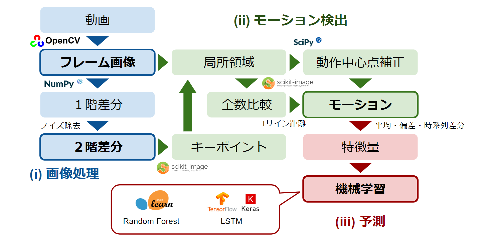
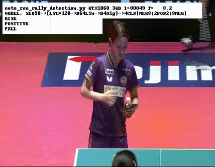
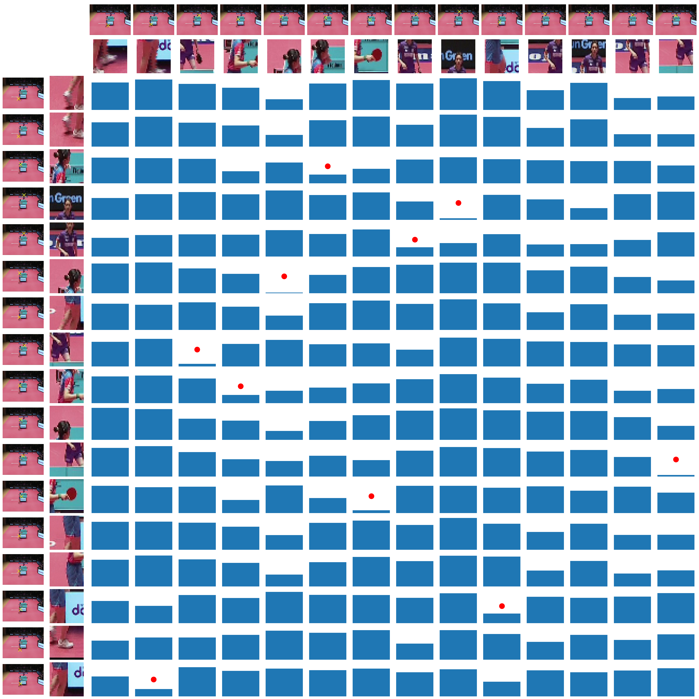
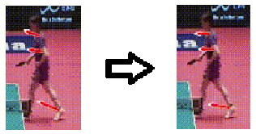
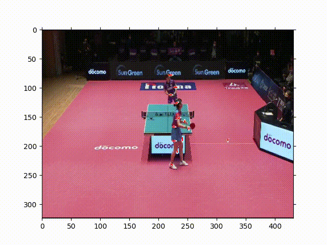
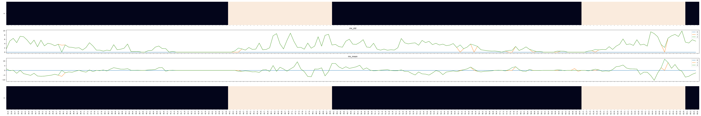
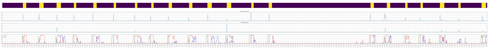

# ids-tt-video-analysis

Tチーム動画分析のリポジトリです。

# 現時点でのプロセス

1. 動画からフレームを抽出
   - はじめは`decord`でやっていた
   - `cv2.VideoCapture`でのフレーム抽出に変更
      - `cv2.VideoCapture`でも`cap.grab`でフレームを読み飛ばすことで高速化できることが判明
   - (a)...抽出したRGBフレーム画像
2. フレーム画像(a)どうしの差分抽出
   - (b)...(a)どうしの差分フレーム（=(a)の１階微分）
   - フレームの差分とその次のフレームの差分の幾何平均によりノイズを取り除けることが判明
   - (c)...差分(b)どうしの幾何平均（≒(a)の２階微分）
3. モーション抽出
   - ノイズ処理後の差分(c)の輝度極大点をキーポイントとして使用（SIFTなどのキーポイントに相当）
   - (d)...(c)から抽出したキーポイント周辺の(a)におけるキー局所領域（SIFTなどのディスクリプタに相当）
   - 隣り合う2つの(c)によるキー領域(d)を全数比較し、両方向からマッチしたキーポイントの差分をモーションとして抽出
   - (e)...抽出したモーション
4. 特徴量抽出
   - (f1)...モーション(e)のx軸方向成分の平均を特徴量にする
   - (f2)...特徴量を時系列分割し、互いの分割の差を生成し、特徴量追加
5. 機械学習
   - (m1)...特徴量(f2)をランダムフォレストで学習＆推定
   - (m2)...特徴量(f1)をLSTMで学習＆推定
   - 予測の良さ（まだ定量化できていない）：(m2)>(m1)





# ~スクリプトの実行~

<!-- TODO: adapt to new-style config -->

1. この階層に`config.py`という名前のファイルを作る
2. 以下の`if`（もしくは`elif`）ブロックを作る（作らなくても可）

   - ＜デバイス名＞は`DESKTOP-O1A234B`のようなパソコンの名前

   ```python
   import os
   import platform
   
   device_name = platform.node()
   
   if device_name == '＜デバイス名＞':
       pass
   ```

3. 以下の定数を定義して設定する

|     VARIABLE NAME      |                                   DESCRIPTION                                    |                        EXAMPLE                         |
|:----------------------:|:--------------------------------------------------------------------------------:|:------------------------------------------------------:|
|    `VIDEO_DIR_PATH`    |               Path to the directory containing the original video                | `os.path.expanduser(r'~/Desktop/idsttvideos/singles')` |
| `FRAME_DUMP_DIR_PATH`  |    Dump destination of [main_process_video_dump.py](./process_video_dump.py)     |        `r'C:\idstt\iDSTTVideoFrameDump\frames'`        |
| `MOTION_DUMP_DIR_PATH` | Dump destination of [main_process_motion_dump.py](./main_process_motion_dump.py) |       `r'C:\idstt\iDSTTVideoFrameDump\motions'`        |
|  `DEFAULT_VIDEO_NAME`  |  Default video name to be used in each process when no video names is specified  |           `'20230205_04_Narumoto_Harimoto'`            |

# ~スクリプトの概要~

|                             NAME                             |      DESCRIPTION       |
|:------------------------------------------------------------:|:----------------------:|
|       [Module storage/npstorage](./storage/npstorage)        |    `np.memmap`のI/O     |
|    [main_process_video_dump.py](./process_video_dump.py)     |  動画からフレームと差分フレームを生成する  |
| [main_process_motion_dump.py](./main_process_motion_dump.py) | 差分フレームからモーションベクトルを生成する |
|                    [train](./label_data)                     |         教師データ          |
|              [train_input.py](./train_input.py)              |        教師データI/O        |

# Local-Maxによるキーポイント検出とモーション検出

- [util_extrema_feature_motion_detector.py](./util_extrema_feature_motion_detector.py)
- [note_extrema_key_frame_motion_detection.py](notes/note_extrema_key_frame_motion_detection.py)
- [note_local_max_featured_motion_detection_mp4_dump.py](notes/note_local_max_featured_motion_detection_mp4_dump.py)


Key-frame distance matrix


# Motion Centroid Correction

- [note_keyframe_center_correction.py](notes/note_keyframe_center_correction.py)



## Correction Disabled


## Correction Enabled

手前の選手の頭に注目

Disabledではベクトルが暴れているがenabledでは暴れが抑えられている



## Correction Disabled


## Correction Enabled



# Random Forest によるモーションの分類

https://github.com/yasu-a/ids-tt-video-analysis/blob/master/presen_materials/start_detection.mp4

# LSTM によるモーションの分類

https://github.com/yasu-a/ids-tt-video-analysis/blob/master/presen_materials/note_rnn_rally_detection/rally_detection_rnn.mp4


